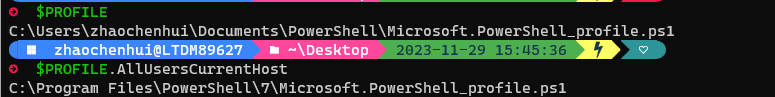

# PowerShell 7
官方文档：[什么是 PowerShell？](https://learn.microsoft.com/zh-cn/powershell/scripting/overview?view=powershell-7.4)  
Termial主题美化：[Oh My Posh](https://ohmyposh.dev/)  
Termial字体：[Nerd Fonts](https://www.nerdfonts.com/#home)  
Git 官方文档：[在 PowerShell 中使用 Git](https://git-scm.com/book/zh/v2/%E9%99%84%E5%BD%95-A%3A-%E5%9C%A8%E5%85%B6%E5%AE%83%E7%8E%AF%E5%A2%83%E4%B8%AD%E4%BD%BF%E7%94%A8-Git-Git-%E5%9C%A8-PowerShell-%E4%B8%AD%E4%BD%BF%E7%94%A8-Git) 
## vscode 改变Terminal字体 
```json
{
    "workbench.colorTheme": "Default Dark Modern",
    "editor.unicodeHighlight.nonBasicASCII": false,
    "Codegeex.Privacy": true,
    "Codegeex.Comment.LanguagePreference": "English",
    "Codegeex.OnlyKeyControl": false,
    "editor.formatOnSave": true,
    "editor.formatOnPaste": true,
    "editor.formatOnType": true,
    "files.autoSave": "onFocusChange",//编辑器失去焦点自动保存
    "files.autoGuessEncoding": true,
    "workbench.list.smoothScrolling": true,
    "editor.cursorSmoothCaretAnimation": "on",
    "editor.smoothScrolling": true,
    "editor.cursorBlinking": "smooth",
    "editor.mouseWheelZoom": true,
    "editor.wordWrap": "on",
    "editor.guides.bracketPairs": true,
    "editor.bracketPairColorization.enabled": true,
    "editor.suggest.snippetsPreventQuickSuggestions": false,
    "editor.acceptSuggestionOnEnter": "smart",
    "editor.suggestSelection": "recentlyUsed",
    "window.dialogStyle": "custom",
    "debug.showBreakpointsInOverviewRuler": true,
    "Codegeex.Explanation.LanguagePreference": "中文",
    "terminal.integrated.fontFamily": "CaskaydiaCove Nerd Font Mono", //改变终端字体
    "terminal.integrated.fontWeightBold": "500", //加粗字体的粗细设置
    "terminal.integrated.cursorStyle": "line", //设置光标样式
}
```
## 改变主题
'notepad'：用于启动记事本应用程序
'$PROFILE'：表示当前用户的 PowerShell 配置文件的路径。它是 PowerShell 为每个用户自动创建的一个变量。
'$PROFILE.AllUsersCurrentHost':表示所有用户的当前主机配置文件。这些配置文件包含了 PowerShell 启动时自动加载的脚本和设置，允许你自定义 PowerShell 环境。
{ loading=lazy }

```
notepad $PROFILE
``` 
内容
```
Import-Module posh-git # 引入 posh-git
oh-my-posh init pwsh --config "$env:POSH_THEMES_PATH/gmay.omp.json" | Invoke-Expression #初始化oh-my-posh
```