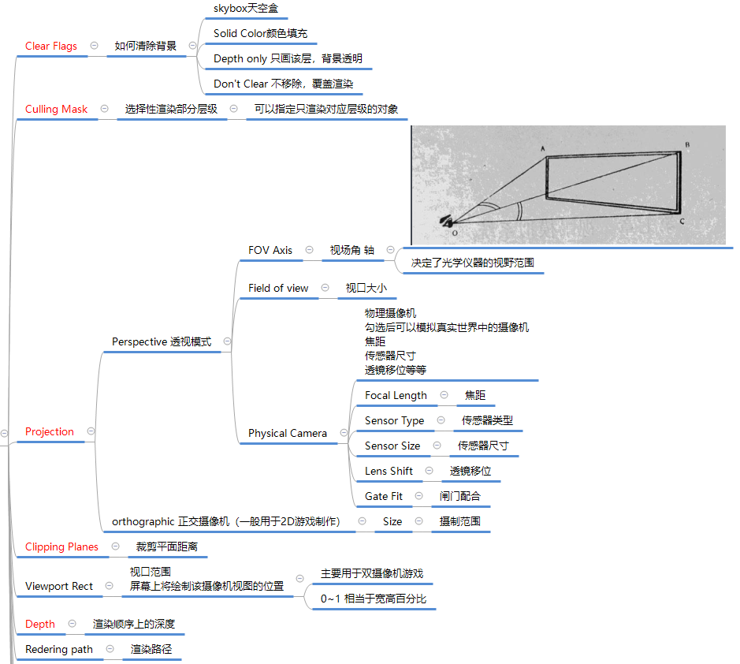

## Camera参数说明
{ loading=lazy }
{ loading=lazy }

## Camera代码相关
### 重要静态成员
获取摄像机
``` C#
//主摄像机的获取
//如果想通过这种方式快速获取摄像机 那么场景上必须有一个tag为MainCamera的摄像机
print(Camera.main.name);
//获取摄像机的数量
print(Camera.allCamerasCount);
        //得到所有摄像机
Camera[] allCamera = Camera.allCameras;
print(allCamera.Length);
```

渲染相关委托
``` C#
//摄像机剔除前处理的委托函数
Camera.onPreCull += (c) =>
{

};

//摄像机 渲染前处理的委托
Camera.onPreRender += (c) =>
{

};

//摄像机 渲染后 处理的委托
Camera.onPostRender += (c) =>
{

};
```

### 重要成员
``` C#
//1.界面上的参数 都可以在Camera中获取到
//比如 下面这句代码 就是得到主摄像机对象 上的深度 进行设置
Camera.main.depth = 10;

//2.世界坐标转屏幕坐标
//转换过后 x和y对应的就是屏幕坐标 z对应的 是 这个3D物体 里我们的摄像机有多远
//我们会用这个来做的功能 最多的 就是头顶血条相关的功能
Vector3 v = Camera.main.WorldToScreenPoint(this.transform.position);
print(v);

//3.屏幕坐标转世界坐标
void Update()
{
    //3.屏幕坐标转世界坐标
    //只所以改变Z轴 是因为 如果不改 Z默认为0
    //转换过去的世界坐标系的点 永远都是一个点 可以理解为 视口 相交的焦点
    //如果改变了Z 那么转换过去的 世界坐标的点 就是相对于 摄像机前方多少的单位的横截面上的世界坐标点
    Vector3 v = Input.mousePosition;
    v.z = 5;
    obj.position = Camera.main.ScreenToWorldPoint(v);
    //print(Camera.main.ScreenToWorldPoint(v));
}
```

## 练习
1. 游戏画面中央有一个立方体，请将该立方体的世界坐标系位置，转换为屏幕坐标，并打印出来
``` C#
print(Camera.main.WorldToScreenPoint(this.transform.position));
```

2. 在屏幕上点击一下鼠标，则在对应的世界坐标位置 创建一个Cube出来
``` C#
void Update()
{
    if( Input.GetMouseButtonDown(0) )
    {
        GameObject obj = GameObject.CreatePrimitive(PrimitiveType.Cube);
        Vector3 v = Input.mousePosition;
        v.z = 20;
        obj.transform.position = Camera.main.ScreenToWorldPoint(v);
    }
}
```