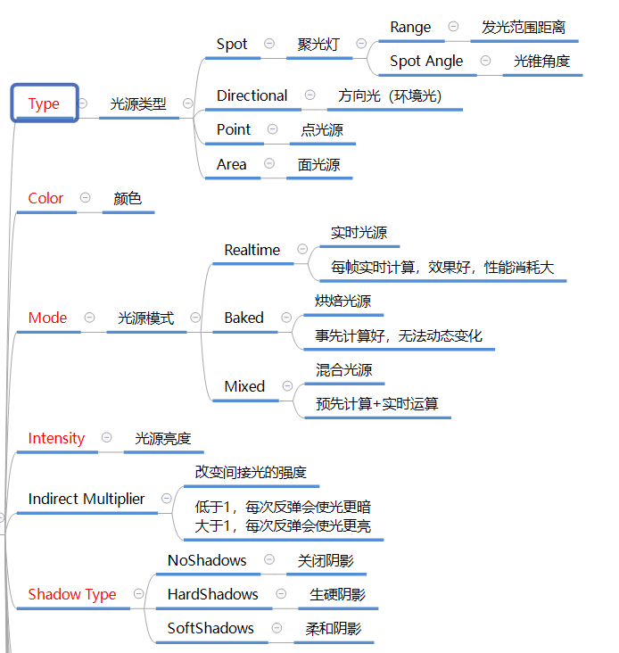
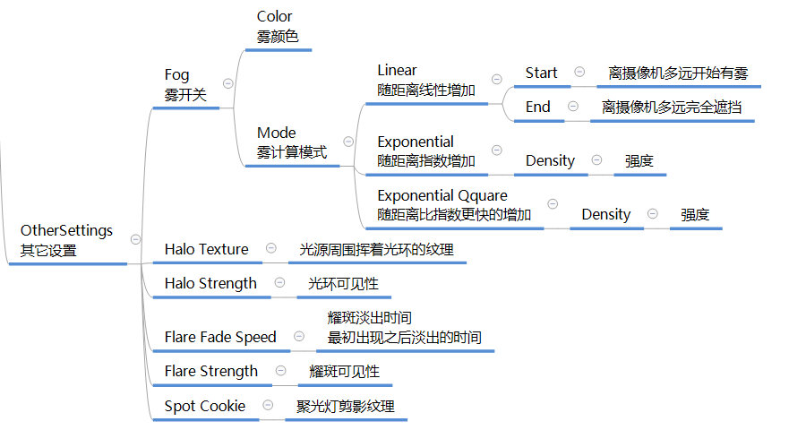

## Light参数说明
{ loading=lazy }
{ loading=lazy }

### 练习 
``` C#
//模拟白天黑夜
public Light _light;
public Transform lightTransorm;
public float rotateSpeed = 10;

void Update()
{
    lightTransform.Rotate(Vector3.right, rotateSpeed * Time.deltaTime);
}

```

## Lighting面板说明
Unity -> Windows -> Rendering -> Lighting Settings

{ loading=lazy }
{ loading=lazy }