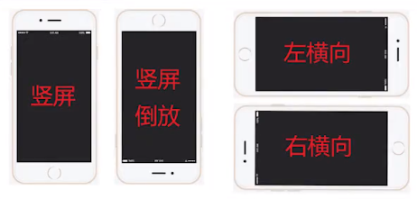

# Screen
## 静态属性
### 常用方法
当前屏幕分辨率
``` C#
Resolution r = Screen.currentResolution;
print("当前屏幕分辨率的宽" + r.width + "高" + r.height);
```

屏幕窗口当前宽高,这得到的是当前窗口(Unity->Game窗口)的宽高,不是设备分辨率的宽高,一般写代码要用窗口宽高做计算时就用他们。
``` C#
print(Screen.width);
print(Screen.height);
```

屏幕休眠模式 
``` C#
Screen.sleepTimeout = SleepTimeout.NeverSleep;
```

### 不常用
运行时是否全屏模式
``` C#
Screen.fullScreen = true;
```

窗口模式
``` C#
//独占全屏FullScreenMode.ExclusiveFullScreen
//全屏窗口FullScreenMode.FullScreenWindow
//最大化窗口FullScreenMode.MaximizedWindow
//窗口模式FullScreenMode.Windowed
Screen.fullScreenMode = FullScreenMode.Windowed;
```
Tip:游戏发布的时可以设置，一般不在代码中设置。

移动设备屏幕转向相关
``` C#
//允许自动旋转为左横向 Home键在左
Screen.autorotateToLandscapeLeft = true;
//允许自动旋转为右横向 Home键在右
Screen.autorotateToLandscapeRight = true;
//允许自动旋转到纵向 Home键在下
Screen.autorotateToPortrait = true;
//允许自动旋转到纵向倒着看 Home键在上
Screen.autorotateToPortraitUpsideDown = true;
```
{ loading=lazy }

指定屏幕的显示方向
``` C#
//只能水平
Screen.orientation = ScreenOrientation.Landscape;
//只能竖直
Screen.orientation = ScreenOrientation.Portrait;
```

## 静态方法
设置分辨率 一般移动设备不使用
``` C#
Screen.SetResolution(1920, 1080, false);
```