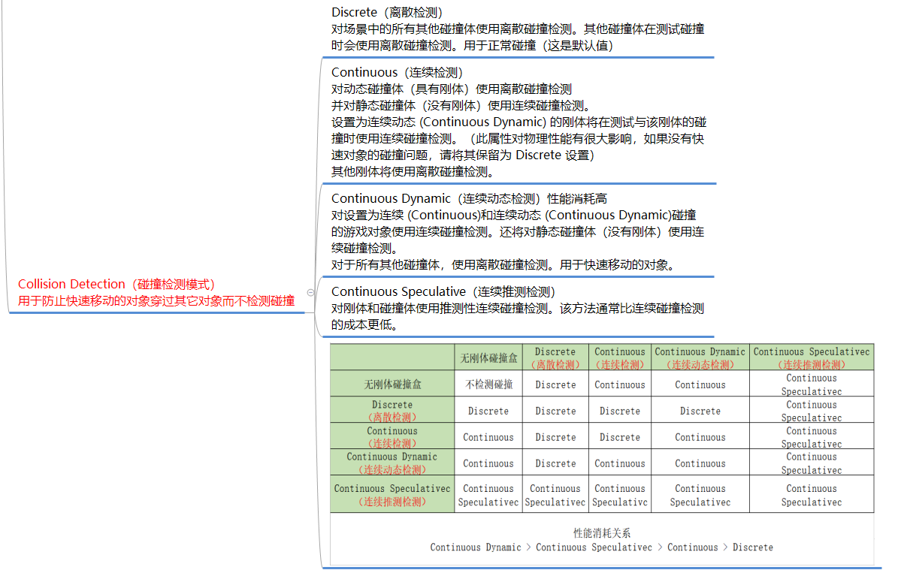
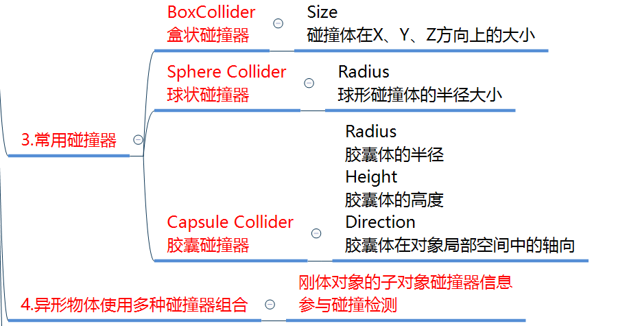

## 刚体
{ loading=lazy }
{ width="578" align=right }
{=align=right }

## 碰撞器
{ loading=lazy }
{ width="670" align=right loading=lazy }  
{ align=right loading=lazy }
{ loading=lazy }
{ loading=lazy }
> !!! 小结
> 1. 网格碰撞器性能开销大，碰撞检测比较准确，不常用于商业项目。
> 2. 轮胎碰撞器适用于赛车游戏。
> 3. 地形碰撞器性能不好，不常用与商业项目。

## 物理材质
{ loading=lazy }
> !!! 小结
> 一般用于小游戏，不用于大型商业游戏。

TIps:  
1. 如何让两个游戏物体之间产生碰撞（至少1个刚体 和 两个碰撞器）  
2. 如何让两个物体之间碰撞时表现出不同效果（物理材质）  
3. 触发器的作用是什么(让两个物体碰撞没有物理效果，只进行碰撞处理)  

## 碰撞检测函数
Tip：碰撞和触发响应函数属于特殊的生命周期函数,也是通过反射调用
### 物理碰撞检测响应函数

``` c#
//碰撞触发接触时会 自动执行这个函数
private void OnCollisionEnter(Collision collision)
{
    //Collision类型的 参数 包含了 碰到自己的对象的相关信息

    //关键参数
    //1.碰撞到的对象碰撞器的信息
    collision.collider

    //2.碰撞对象的依附对象（GameObject）
    collision.gameObject

    //3.碰撞对象的依附对象的位置信息
    collision.transform

    //4.触碰点数相关
    collision.contactCount

    //接触点 具体的坐标
    ContactPoint[] pos = collision.contacts;
    //只要得到了 碰撞到的对象的 任意一个信息 就可以得到它的所有信息
    
    print(this.name + "被" + collision.gameObject.name + "撞到了");
}

//碰撞结束分离时  会自动执行的函数
private void OnCollisionExit(Collision collision)
{
    print(this.name + "被" + collision.gameObject.name + "结束碰撞了");
}

//两个物体相互接触摩擦时 会不停的调用该函数
private void OnCollisionStay(Collision collision)
{
    print(this.name + "一直在和" + collision.gameObject.name + "接触");
}
```

### 触发器检测响应函数
``` c#
protected virtual void OnTriggerEnter(Collider other)
{
    print(this.name + "被" + other.gameObject.name + "触发了");
}

//触发结束的函数 当相融的状态结束时 会调用一次
private void OnTriggerExit(Collider other)
{
    print(this.name + "被" + other.gameObject.name + "结束相融的状态了");
}

//当两个对象子相融的时候 会不停调用
private void OnTriggerStay(Collider other)
{
    print(this.name + "和" + other.gameObject.name + "正在相融");
}
```

### 要明确什么时候会响应函数
1. 只要挂载的对象 能和别的物体产生碰撞或者触发 那么对应的这6个函数 就能够被响应
2. 6种函数一般是根据需求来进行选择书写
3. 如果是一个异形物体，刚体在父对象上，如果你想通过子对象上挂脚本检测碰撞是不行的，必须挂载到这个刚体父对象上才行
4. 要明确 物理碰撞和触发器响应的区别

> !!! 碰撞和触发器函数都可以写成虚函数 在子类去重写逻辑
> 一般会把想要重写的 碰撞和触发函数 写成保护类型的 没有必要写成public 因为不会自己手动调用 都是Unity通过反射帮助我们自动调用的